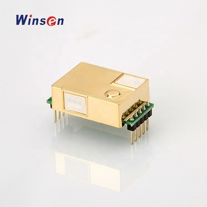
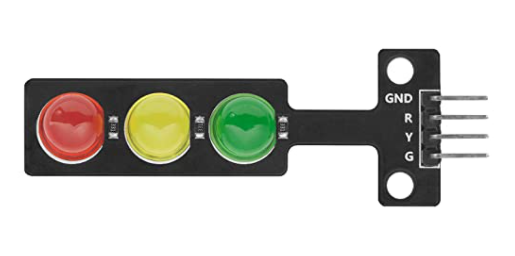
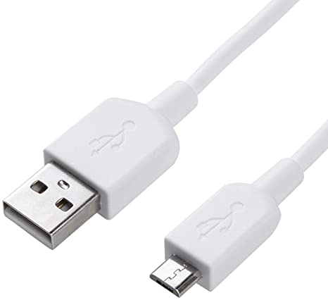
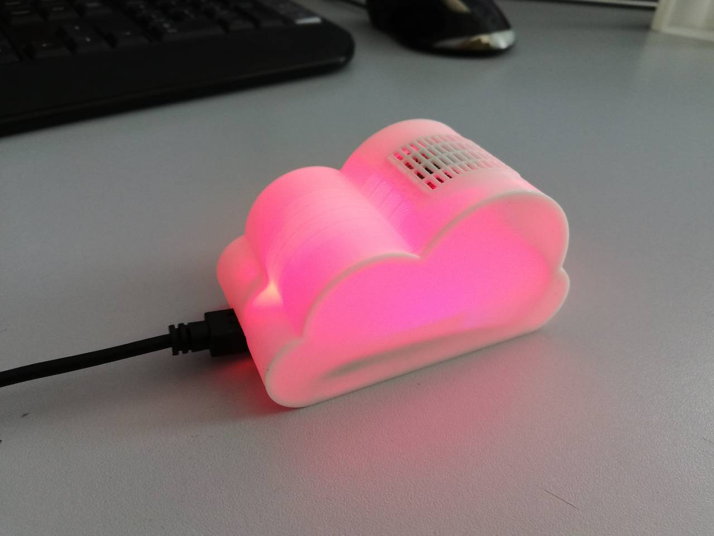
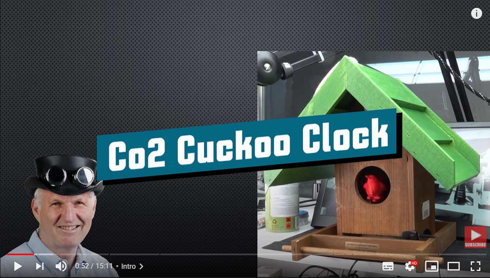
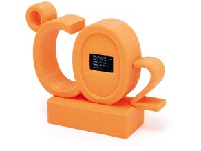

# 💪CODOS💪

## Un sistema de bajo coste basado en ESP8266/ESP32 para la detección del CO2 y otras variables ambientales para monitorizar la calidad del aire en el aula (o en otros lugares de trabajo)

*(Se trata de un proyecto en constante actualización y este documento está en constante redacción)*

*"Algunos científicos comentan que mejorar la ventilación y la calidad del aire es un método que las escuelas pueden usar para reducir el riesgo de transmisión del coronavirus.
Sin embargo, en una encuesta entre distritos escolares grandes del Norte de Texas, The Dallas Morning News encontró que las escuelas están lejos de alcanzar los parámetros de calidad del aire propuestos en junio por expertos en construcción.
Investigadores de la Universidad de Harvard recomendaron instalar filtros de aire de alta graduación, limpiadores de aire portátiles y fuentes de luz ultravioleta dentro de los conductos de aire para eliminar al virus.
Al revisar el nivel de dióxido de carbono en las aulas se puede comprobar si está entrando suficiente aire fresco..."*

Fuente: https://noticiasenlafrontera.net/escuelas-no-siguen-recomendaciones-de-calidad-del-aire-parar-reducir-exposicion-a-covid-19/

Otro artículo con información al respecto, (gracias Lina por el enlace):

https://www.caloryfrio.com/construccion-sostenible/ventilacion-y-calidad-aire-interior/colegios-coronavirus-calidad-aire-interior-ventilacion-adecuada-covid-19.html

Existen además evidencias de que los altos niveles de CO2 influyen sobre el rendimiento de los alumnos en el aula.
https://pubmed.ncbi.nlm.nih.gov/25117890/

Artículos cómo estos y otros me han llevado a elaborar un pequeño dispositivo de bajo coste que permita monitorizar los niveles de CO2 en las aulas con el objeto de poder medir la concentración de dicho gas y de esta forma saber cuándo tenemos que renovar el aire de un aula para poder seguir de la mejor forma posible las propias indicaciones al respecto de las administraciones públicas españolas:

https://www.miteco.gob.es/es/ministerio/medidas-covid19/sistemas-climatizacion-ventilacion/default.aspx

Si quieres saber más no dejes de leer este interesantísimo hilo en twitter: https://twitter.com/PabloFuente/status/1297457593368088576

Utilizando una hoja de cálculo podemos calcular la cantidad de CO2  en función de diversas variables del aula. En el siguiente artículo tenemos una calculadora que permite hacer dicho cálculo, (gracias Mercedes por el enlace):

https://medium.com/@jjose_19945/how-to-quantify-the-ventilation-rate-of-an-indoor-space-using-a-cheap-co2-monitor-4d8b6d4dab44

Este enlace https://schools.forhealth.org/ventilation-guide/ nos dice también cómo y cuánto debemos ventilar...

## ¿Qué es 💪CODOS💪?

💪CODOS💪 es un pequeño circuito electrónico construido sobre un microcontrolador ESP32, un microcontrolador similar a un Arduino pero que ofrece conectividad WiFi y Bluetooth, aunque también hay otros Arduinos como el MKR1000 WiFi que te podrían servir.

Esto significa que podemos usar dispositivos de [Internet de las Cosas, (IoT)](https://es.wikipedia.org/wiki/Internet_de_las_cosas) que nos permiten monitorizar los datos de los sensores conectados a los mismos a través de Internet.

CODOS está pensado para medir la cantidad de CO2 y otros parámetros ambientales para recomendarnos cuando deberíamos renovar el aire de un aula u otro espacio de trabajo, sobre todo cuando no se disponga de un sistema de ventilación forzada, o bien no sea posible mantener las ventanas abiertas todo el tiempo.

Pupils at Henrietta Barnett School in Hampstead Garden Suburb raise their arms during a Key Stage Three maths lesson, the school received high scores during their Key Stage Three results, Wednesday 27 February, 2008. Photo: Jane Mingay

*CODOS (aka CO2) es un guiño a hincar los "CO2" en el aula... ;)*

* Con un simple Arduino, un sensor de CO2 y unos led podemos construir un sistema simplificado que permita indicar cuando los niveles de CO2 están dentro de unos determinado umbrales, esa fue mi primera idea y publicaré también esta versión; pero cambiando el Arduino por un ESP8266 o un ESP32 podemos además enviar los datos a un servidor y monitorizar por ejemplo los datos de distintas aulas de forma centralizada, almacenar datos estadísticos en una base de datos o realizar otras muchas tareas que podrían sernos útiles sin incrementar prácticamente el coste del dispositivo.

### BOM (Bill of materials) / Lista de materiales
En su versión IoT, para construir CODOS se necesitan los siguientes elementos:
- Un ESP32 por ejemplo el ESP32-DOIT-DEVKIT (también puedes utilizar un ESP8266)

- Un sensor de eCO2 CCS811 (he probado también con otros sensores como el Sensirion SDC30 pero su coste es mucho más elevado)

 

- Otra posibilidad es utilizar este otro sensor; pero también algo más caro es, el MH-Z19b, su gran ventaja es que se trata de un sensor NDIR por lo que mide directamente CO2 

- Opcionalmente un sensor de humedad, presión y temperatura BME280

- Opcionalmente leds de varios colores por ejemplo rojo, naranja y verde para construir un "semáforo" que indique los niveles de CO2 o directamente utilizar un módulo de semáfot

 

- Opcionalmente una pantalla OLED SSD1306 u otra (o un ESP32 que la incluya)

- Necesitarás además cables dupont para conectar entre sí los distintos elementos.

- Para alimentar el dispositivo podrás utilizar el puerto USB de un ordenador o mejor un cargador de móvil con conexión microUSB para los ESP o el que corresponga para el Arduino

## Montaje

### Versión Arduino

Vamos a exponer primero de forma sencilla cómo se conecta el sensor de CO2 CCS811 a un Arduino Nano o UNO, esta versión es la más económica y sencilla del dispositivo. Simplemente hemos de utilizar 5 cables Dupont hembra-hembra o macho-hembra respectivamente y unir los siguientes pines del sensor a otros tantos pines del Arduino:

- **Vcc** con un cable rojo lo uniremos al pin de 3.3V del Arduino
- **GND** con un cable negro lo uniremos a uno de los pines GND del Arduino
- **SDA** se conecta al pin A4 del Arduino
- **SCL** se conecta al pin A5 del Arduino
- **Wake** o **AWake** se conecta al otro pin GND del Arduino, aunque también podría controlarse con pin de salida.

*Conexión del sensor CCS811 a un Arduino UNO*

Luego simplemente hemos de conectar un cable USB y podremos programar el Arduino con el código necesario para poder leer los datos del sensor.

Puedes utilizar el código de la carpeta dev/plotter para monitorizar los valores del CO2 y la TVOC gráficamente. Puedes acceder al mismo en el siguiente enlace: https://github.com/miguelangelcasanova/codos/blob/master/dev/arduino/plotter/plotter.ino

El código está completamente comentado por lo que si lo deseas no debería resultarte muy dificil poder adaptarlo a tus necesidades.

En esta versión del dispositivo los datos sólo pueden monitorizarse a través de un ordenador conectado mediante dicho cable USB, por eso en la versión definitiva utilizaremos un ESP8266 o un ESP32 que funcionan de forma similar pero permiten además enviar los datos vía WiFi y en el caso del ESP32 también vía Bluetooth.

Descarga el archivo, envía el firmware al Arduino y abre el monitor serie o mejor el plotter serie y podrás visualizar los valores del sensor:

*Monitor serie del IDE de Arduino*

*Serial Plotter del IDE de Arduino*

### Version ESP8266 / ESP32

La conexión de los sensores es muy similar a la que hemos descrito para el arduino y es también muy sencilla, tanto el sensor de CO2 como el sensor ambiental utilizados utilizan conexiones i2c, es decir basta con alimentarlos a 3.3V y masa. Luego hay que conectar a los **GPIO22** y **GPIO21** que en el ESP32 corresponden a las conexiones SCL y SDA del mencionado protocolo respectivamente o a los pines **D2** y **D1** que corresponden igualmente a SDA y SCL para el ESP8266.

Si deseas conectar la pantalla OLED o el sensor ambiental BME280, se conectan también en estos mismos pines en ambos casos.

*Pinout del ESP8266*

*Pinout del ESP32*

Dado que podemos utilizar dos pines para conectar varios sensores o la pantalla necesitaremos utilizar una placa de prototipos o diseñar una placa de circuito impreso para conectarlos todos en el mismo punto.

 *Conexión del sensor CCS811 a un ESP con una placa protoboard*

Para la conexión de los diodos led al tratarse de salidas de 3.3V deberíamos utilizar resistencias limitadoras de corriente y conectarlos a través de estas a cualquiera de los GPIO, yo he escogido los GPIO9, 10 y 11. Al conectar los diodos led hemos de tener en cuenta su polaridad.

### Otras versiones
Gracias a otros miembros de la comunidad el proyecto ha ido creciendo y enriqueciéndose con las contribuciones de makers, makerspaces y fablabs.

En la carpeta esp32 hay a tu disposición una versión avanzada que incluye el uso de bases de datos como InfluxDB para almacenar y visualizar en el futuro los datos de muchos sensores creada por Andreas del Makespace Mallorca.

### El programa
También he diseñado varias versiones del programa según la plataforma utilizada.
El programa debe cargarse desde el entorno IDE de Arduino o desde VS Studio Code (Platformio) en la placa correspondiente.

### El dispositivo
He diseñado una caja imprimible en 3D para poder albergar el dispositivo aunque este puede montarse directamente sobre una placa de prototipos si no se tiene la habilidad para soldar unos cuantos componentes aunque su montaje debería resultar especialmente sencillo.

En la carpeta STL hay diseños de cajas imprimibles en 3D y en Thingiverse puedes encontrar también otros modelos.

### Usando el dispositivo
El dispositivo se conecta automáticamente a la red del aula para permitir que los datos de los sensores pueden visualizarse en una página web que genera el dispositivo desde cualquier otro dispositivo conectado a la misma red. Para ello debes averiguar la dirección IP del dispositivo y abrir en tu navegador una URL del tipo siguiente: http://192.168.1.105 dónde los números indican la dirección IP local del dispositivo en la red local.

*Pantalla de datos de las primeras versiones de CODOS*

### Información para el calibrado de los sensores
Documentación para estudiar el comportamiento de los sensores en aire bajo condiciones controladas mediante materiales caseros.
[PROCEDIMIENTO](/doc/C%C3%A1lculos%20de%20concentraci%C3%B3n%20de%20CO2.pdf)

### To do
En un proyecto como este hay muchas cosas que siempre quedan por hacer. Por ejemplo, la calibración de los sensores es fundamental y no está bien probada, también es necesario hacer pruebas de campo montando sensores en las aulas y tomando medidas para comprobar su fiabilidad.
Si quieres colaborar no tienes más que ponerte en contacto con el grupo de trabajo por Telegram: https://t.me/codos_ventilacion (a 31 de octubre en el grupo hay 150 personas).

### Preguntas frecuentes

#### ¿Cuál es el objetivo del proyecto?
Dotar a las aulas y otros espacios de trabajo de una forma sencilla y económica
de medir la calidad del aire, en concreto de la concentración de CO2

#### ¿Dónde comprar los componentes?

El ESP32 y los leds se pueden comprar en muchas tiendas físicas de electrónica en España o a través de Internet. En China por supuesto resultan mucho más económico; pero tardarás en tenerlo varias semanas en tener los componentes en tus manos.
Los sensores son un poco más difíciles de localizar en tiendas físicas pero puedes adquirirlos igualmente en China o un poco más caros encontrarlos a través de ebay o Amazon.

El ESP32 lo puedes comprar en España por unos 10€ por ejemplo en:

https://www.ebay.es/itm/EL0116-ESP-WROOM-32-ESPRESSIF-Placa-Desarrollo-Arduino-WiFi-Bluetooth-Dual-Core/233565682462

En la misma tienda puedes comprar los LEDs y unos cables Dupont hembra-hembra.

En ebay y en Amazon hay muchas tiendas que te ofrecen el sensor de CO2 o el de humedad y temperatura pero su coste es mucho más elevado que pidiéndolo a China:

https://www.ebay.es/itm/CCS811-Carbon-Monoxide-CO-VOCs-Air-Quality-Numerical-Gas-Sensors-CJMCU-811/323688562130

https://www.amazon.es/TECNOIOT-Monoxide-Quality-Numerical-CJMCU-811/dp/B07RGLMS1J

Este es otro modelo que resulta también muy económico:

https://www.amazon.es/KEYESTUDIO-Quality-Arduino-Monoxide-Numeric/dp/B086HCSM6N/ref=sr_1_1?__mk_es_ES=%C3%85M%C3%85%C5%BD%C3%95%C3%91&dchild=1&keywords=ccs811&qid=1598700075&refinements=p_85%3A831314031&rnid=831276031&rps=1&sr=8-1

Comprando 5 unidades del ESP32 te salen a 6€ en el siguiente enlace:

https://www.amazon.es/gp/product/B074RG86SR

En Aliexpress últimamente están entregando en 10 días (Hoy es 29/08/2020)

https://es.aliexpress.com/item/32903358923.html?spm=a2g0o.productlist.0.0.26bc4071sE7mf2&algo_pvid=159e700e-7ec4-41f6-a8b4-ef1eb37b29d2&algo_expid=159e700e-7ec4-41f6-a8b4-ef1eb37b29d2-0&btsid=0b0a0ad815986989110232476e8172&ws_ab_test=searchweb0_0,searchweb201602_,searchweb201603_

El MH-Z19b lo puedes adquirir también en Amazon o Aliexpress por unos 16-25€:
https://es.aliexpress.com/item/32946106807.html?srcSns=org.telegram.messenger&spreadType=socialShare&bizType=ProductDetail&tt=MG&image=U6c2b63d49cee4cc1935c5c06de0e2df9L.jpg&aff_platform=default&sk=_BSWtFw&description=%E2%82%AC+14%2C50++13%25OFF+%7C+Sensor+de+co2+infrarrojo+MH-Z19+para+co2%2C+monitor+MH-Z19B%2C+Sensor+de+gas+co2+de+di%C3%B3xido+de+carbono%2C+0-5000ppm&aff_trace_key=1c43dcc98a834a8fa43b79f907dd3d5b-1604748762672-07455-_BSWtFw&businessType=ProductDetail&title=%E2%82%AC+14%2C50++13%25OFF+%7C+Sensor+de+co2+infrarrojo+MH-Z19+para+co2%2C+monitor+MH-Z19B%2C+Sensor+de+gas+co2+de+di%C3%B3xido+de+carbono%2C+0-5000ppm&platform=AE&terminal_id=a42b9e0f7a294b098d58d5efd3cad8cf

#### Otros proyectos parecidos

- *Air quality sensor:* This simple, fancy looking, ESP8266 based sensor measures values of CO2 and TVOC air pollutants. As output there is addressable RGB led strip, and/or optional OLED display which can show real time levels. https://github.com/Luc3as/Air-quality-Sensor/ (en inglés)

   
   
- *CO2 Cuckoo Clock for schools and businesses (Why not eCO2?)* del maker y youtuber suizo Andreas Spiess:  https://www.youtube.com/watch?v=hcPdZlpaRTo (en inglés)
  
  
  
- 
- *Air quality meter:* http://www.futurashop.it/breakout-CCS811-air-quality-ft1331m-qualit%C3%A0%20aria?search=ccs811 (en italiano) 
  La caja puedes descargarla d*Air quality meter* (de David Daghetta, en Thingiverse): https://www.thingiverse.com/thing:2569792 (en Inglés)

*(Este documento está en constante redacción)*
